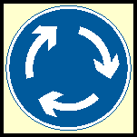
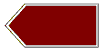
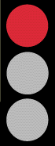
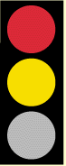
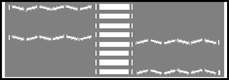

###4436 - CARS11.1

You MUST obey signs giving orders.
These signs are mostly in:

1. Blue rectangles
2. Red triangles
3. Green rectangles
4. **Red circles**

###4437 - CARS11.25

At a mini-roundabout you should:

1. **Give way to traffic from the right**
2. Stop even when clear
3. Give way to traffic from the other way
4. Give way to traffic from the left

###4438 - CARS11.27

What does a circular traffic sign with a blue background do?

1. Give motorway information
2. Give directions to a car park
3. Give warning of a motorway ahead
4. **Give an instruction**

###4439 - CARS11.29

What does a sign with a brown background show?

1. **Tourist directions**
2. Minor routes
3. Motorway routes
4. Primary roads

###4441 - CARS11.30

What are triangular signs for?

1. **To give warnings**
2. To give directions
3. To give order
4. To give information

###4442 - CARS11.34

Which FOUR of these would be indicated by a triangular road sign?

1. Ahead only
2. **Children crossing**
3. **T-junction**
4. **Road narrows**
5. **Tunnel ahead**
6. Minimum speed

###4443 - CARS11.55

You are approaching a red traffic light. The signal will change from red to:

1. **Red and amber then green**
2. Green and amber then green
3. Amber then green
4. Green then amber

###4444 - CARS11.55

A red traffic light means:

1. Proceed with caution
2. Stop if you are able to brake safely
3. **You must stop and wait behind the stop line**
4. You should stop unless turning left

###4445 - CARS11.57

At traffic lights amber on its own means:

1. Go if no pedestrians are crossing
2. Go if the way is clear
3. Prepare to go
4. **Prepare to stop at the stop line**

###4446 - CARS11.58

A red traffic light means:

1. **You must stop behind the white stop line**
2. You must slow down and prepare to stop if traffic has started to cross
3. You may turn left if it is safe to do so
4. You may drive straight on if there is no other traffic

###4447 - CARS11.59

You are approaching traffic lights. Red and amber are showing. This means:

1. The lights are about to change to red
2. There is a fault with the lights - take care
3. **Wait for the green light before you pass the lights**
4. Pass the lights if the road is clear

###4448 - CARS11.60

You are at a junction controlled by traffic lights. When should you NOT proceed at green?

1. When you intend to turn right
2. **When your intended route from the junction is blocked**
3. When you think the lights may be about to change
4. When pedestrians are waiting to cross

###4449 - CARS11.61

What do these zigzag lines at pedestrian crossings mean?

1. **No parking at any time**
2. Sounding of horns is not allowed
3. Slow down to 20kph
4. Parking allowed only for a short time

###4450 - CARS11.66

You are to turn right in busy traffic. How would you confirm your intention safely?

1. Position over the centre line at an angle
2. **Give an arm signal as well as an indicator signal**
3. Flash your headlamp
4. Sound the horn

###4451 - CARS11.67

You want to turn right at a junction but you think that your indicators cannot be seen clearly. What should you do?

1. Keep well over to the right
2. Stay in the left-hand lane
3. Get out and check if your indicators can be seen
4. **Give an arm signal as well as an indicator signal**

###4453 - CARS11.69

Why should you make sure that you have cancelled your indicators after turning?

1. To avoid damage to the indicator relay
2. **To avoid misleading other road users**
3. To avoid dazzling other road users
4. To avoid flattening the battery

###4454 - CARS11.70

You are waiting at a T-junction. A vehicle is coming from the right with the left signalflashing. What should you do?

1. Move out slowly
2. **Wait until the vehicle starts to turn in**
3. Pull out before the vehicle reaches the junction
4. Move out and accelerate hard

###4455 - CARS11.73

What is the maximum speed limit in a built up area unless indicated otherwise?

1. 60 kph
2. 40 kph
3. **50 kph**
4. 30 kph
