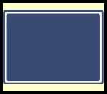
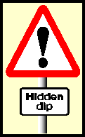
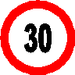

###4436 - CARS11.1

You must obey signs giving orders. These signs are mostly in:

1. Blue rectangles
2. Red triangles
3. Green rectangles
4. **Red circles**

###4493 - CARS11.2

Traffic signs giving orders are generally which shape?

1.  
2.  
3. 
4. 

###4494 - CARS11.3

Which type of sign tells you NOT to do something?

1.  
2.  
3. 
4. 

###4495  - CARS11.4

What does this sign mean? 

1. **Maximum speed limit with traffic calming measures**
2. Only 20 cars allowed at any one time
3. Parking area for 20 cars only
4. Minimum speed limit with traffic calming measures

###4496 - CARS11.5

Which sign means no motor vehicles are allowed?

1.  
2.  
3. 

###4497 - CARS11.6

Which of these signs means no motor vehicles?

1.  
2.  
3. 

###4498 - CARS11.7

What does this sign mean?

1. Minimum speed limit 30 kph
2. No vehicles over 30 tonnes
3. New speed limit 20 kph
4. **End of 20 kph zone**

###4499 - CARS11.8

What does this sign mean?

1. **No motor vehicles**
2. Cars and motorcycles only
3. Clearway (no stopping)
4. No overtaking

###4500 - CARS11.9

What does this sign mean?

1. No through road
2. No road markings
3. No parking
4. **No entry**

###4501 - CARS11.10

What does this sign mean?

1. No traffic from the right
2. Road on the right closed
3. Bend on the right
4. **No right turn**

###4502  - CARS11.11

Which sign means "no entry"?

1.  
2.  
3. 
4. 

###4503 - CARS11.12

What does this sign mean?

1. Two-way traffic
2. No motor vehicles
3. You have priority
4. **No overtaking**

###4504 - CARS11.13

What does this sign mean?

1. Form two lanes
2. Give way to oncoming traffic
3. **Do not overtake**
4. Keep in one lane

###4505 - CARS11.14

What does this sign mean?

1. **Waiting restrictions apply**
2. Clearway (no stopping)
3. National speed limit applies
4. Waiting permitted

###4506  - CARS11.15

Which sign means "no stopping"?

1.  
2.  
3. 
4. 

###4507  - CARS11.16

What does this sign mean?

1. Roundabout
2. No entry
3. **No stopping**
4. Crossroads

###4508  - CARS11.17

You see this sign ahead. It means:

1. National speed limit applies
2. No entry
3. **No stopping**
4. Waiting restrictions apply

###4509  - CARS11.18

What does this traffic sign mean?

1. No overtaking allowed
2. One-way traffic only
3. Two way traffic
4. **Give priority to oncoming traffic**

###4510  - CARS11.19

What is the meaning of this traffic sign?

1. Bus lane ahead
2. Give priority to vehicles coming towards you
3. **You have priority over vehicles coming towards you**
4. End of two-way road

###4511  - CARS11.20

Which sign means "traffic has priority over oncoming vehicles"?

1.  
2.  
3. 
4. 

###4512  - CARS11.21

What must you do when you see this sign?

1. Stop only if a red light is showing
2. Stop only if children are waiting to cross
3. Stop only if traffic is approaching
4. **Stop even if the road is clear**

###4513  - CARS11.22

What does this sign mean?

1. Two-way traffic ahead
2. You are entering a one-way street
3. No overtaking
4. **You have priority over vehicles from the opposite direction**

###4514  - CARS11.23

What shape is a stop sign at a junction?

1.  
2.  
3. 
4. 

###4515  - CARS11.24

Which shape is used for giveway sign?

1.  
2.  
3. 
4. 

###4437 - CARS11.25

At a mini-roundabout you should:

1. **Give way to traffic from the right**
2. Stop even when clear
3. Give way to traffic from the other way
4. Give way to traffic from the left

###4516 - CARS11.26

What does this sign mean?

1. Give way to oncoming vehicles
2. Turn off at the next available junction
3. Approaching traffic passes you on both sides
4. **Pass either side to get to the same destination**

###4438 - CARS11.27

What does a circular traffic sign with a blue background do?

1. Give motorway information
2. Give directions to a car park
3. Give warning of a motorway ahead
4. **Give an instruction**

###4439 - CARS11.29

What does a sign with a brown background show?

1. **Tourist directions**
2. Minor routes
3. Motorway routes
4. Primary roads

###4441 - CARS11.30

What are triangular signs for?

1. **To give warnings**
2. To give directions
3. To give order
4. To give information

###4517 - CARS11.31

What does this sign mean?

1. Give way
2. **T-junction**
3. No through road
4. Turn left ahead

###4518 - CARS11.32

What does this sign mean?

1. Ring road
2. Mini-roundabout
3. No vehicles
4. **Roundabout**

###4519 - CARS11.33

What does this sign mean?

1. **Crossroads**
2. Ahead only
3. Level crossing without gate
4. Level crossing with gate

###4442 - CARS11.34

Which four of these would be indicated by a triangular road sign?

1. Ahead only
2. **Children crossing**
3. **T-junction**
4. **Road narrows**
5. **Tunnel ahead**
6. Minimum speed

###4520  - CARS11.35

Which shape is used for giveway sign?

1.  
2.  
3. 
4. 

###4521  - CARS11.36

Which of these signs warn you of a pedestrian crossing?

1.  
2.  
3. 
4. 

###4522 - CARS11.37

What does this sign mean?

1. No footpath ahead
2. School crossing ahead
3. **Pedestrian crossing ahead**
4. Pedestrians only ahead

###4523 - CARS11.38

What does this sign mean?

1. School crossing patrol
2. Pedestrian zone - no vehicles
3. No pedestrians allowed
4. **Pedestrian crossing ahead**

###4524  - CARS11.39

Which of these signs means there is a double bend ahead?

1.  
2.  
3. 
4. 

###4525 - CARS11.40

What does this sign mean?

1. Humpback bridge
2. **Humps in the road**
3. Exiting tunnels
4. Entrance to tunnel

###4526 - CARS11.41

What does this sign mean?

1. Low bridge ahead
2. **Tunnel ahead**
3. Accident black spot ahead
4. Ancient monument ahead

###4527  - CARS11.42

Which of these signs means the end of a dual carriageway?

1.  
2.  
3. 
4. 

###4528 - CARS11.43

What does this sign mean?

1. **End of dual carriageway**
2. End of narrow bridge
3. Road narrows
4. Tall bridge

###4529 - CARS11.44

What does this sign mean?

1. Two-way traffic ahead across a one-way street
2. Motorway contra flow system ahead
3. **Two-way traffic straight ahead**
4. Traffic approaching you has priority

###4530 - CARS11.45

What does this traffic sign mean?

1. Slippery road ahead
2. Service area ahead
3. **Danger ahead**
4. Tyres liable to punctures ahead

###4531 - CARS11.46

You are about to overtake when you see this sign. You should:

1. Switch your headlights on before overtaking
2. Move to the right to get a better view
3. Overtake the other driver as quickly as possible
4. **Hold back until you can see clearly ahead**

###4532 - CARS11.47

What does this sign mean?

1. Steep hill upwards
2. **Steep hill downwards**
3. Uneven road
4. Adverse camber

###4533 - CARS11.48

What does this sign mean?

1. **Quayside or river bank**
2. Road liable to flooding
3. Slippery road
4. Steep hill downwards

###4534 - CARS11.49

What does this sign mean?

1. Turn left for ferry terminal
2. **No through road on the left**
3. No entry for traffic turning left
4. Turn left for parking area

###4535 - CARS11.50

What does this sign mean?

1. Toilet ahead
2. Telephone box ahead
3. T-junction
4. **No through road**

###4536  - CARS11.51

Which sign means "no through road"?

1.  
2.  
3. 

###4537  - CARS11.52

Which of the following signs informs you that you are coming to a no through road?

1.  
2.  
3. 

###4538 - CARS11.53

What does this sign mean?

1. The right-hand lane ahead is narrow
2. Right hand lane for turning right
3. Right-hand lane for buses only
4. **The right-hand lane ahead is closed**

###4538 - CARS11.54

You see this traffic light ahead. Which light(s) will come on next?

1. **Red alone**
2. Green alone
3. Green and amber together
4. Red and amber together

###4443 - CARS11.55

You are approaching a red traffic light. The signal will change from red to:

1. **Red and amber then green**
2. Green and amber then green
3. Amber then green
4. Green then amber

###4444 - CARS11.56

A red traffic light means:

1. Proceed with caution
2. Stop if you are able to brake safely
3. **You must stop and wait behind the stop line**
4. You should stop unless turning left

###4445 - CARS11.57

At traffic lights amber on its own means:

1. Go if no pedestrians are crossing
2. Go if the way is clear
3. Prepare to go
4. **Prepare to stop at the stop line**

###4446 - CARS11.58

A red traffic light means:

1. **You must stop behind the white stop line**
2. You must slow down and prepare to stop if traffic has started to cross
3. You may turn left if it is safe to do so
4. You may drive straight on if there is no other traffic

###4447 - CARS11.59

You are approaching traffic lights. Red and amber are showing. This means:

1. The lights are about to change to red
2. There is a fault with the lights - take care
3. **Wait for the green light before you pass the lights**
4. Pass the lights if the road is clear

###4448 - CARS11.60

You are at a junction controlled by traffic lights. When should you NOT proceed at green?

1. When you intend to turn right
2. **When your intended route from the junction is blocked**
3. When you think the lights may be about to change
4. When pedestrians are waiting to cross

###4449 - CARS11.61

What do these zigzag lines at pedestrian crossings mean?

1. **No parking at any time**
2. Sounding of horns is not allowed
3. Slow down to 20 kph
4. Parking allowed only for a short time

###4540 - CARS11.62

This marking appears on the road just before a

1. No through road sign
2. **Give way sign**
3. Stop sign
4. No entry sign

###4541 - CARS11.63

You see this line across the road at the entrance to a roundabout. What does it mean?

1. **Give way to traffic from the right**
2. Stop at the line
3. You have right of way
4. Traffic from the left has right of way

###4542 - CARS11.64

The driver of the car in front is giving this signal. What does it mean?

1. The driver wishes to overtake
2. The driver intends to turn right
3. The driver is slowing down
4. **The drivers intends to turn left**

###4543 - CARS11.65

The driver of this car is giving an arm signal. What is he about to do?

1. Let pedestrians cross
2. **Turn to the left**
3. Go straight ahead
4. Turn to the right

###4450 - CARS11.66

You are to turn right in busy traffic. How would you confirm your intention safely?

1. Position over the centre line at an angle
2. **Give an arm signal as well as an indicator signal**
3. Flash your headlamp
4. Sound the horn

###4451 - CARS11.67

You want to turn right at a junction but you think that your indicators cannot be seen clearly. What should you do?

1. Keep well over to the right
2. Stay in the left-hand lane
3. Get out and check if your indicators can be seen
4. **Give an arm signal as well as an indicator signal**

###4453 - CARS11.69

Why should you make sure that you have cancelled your indicators after turning?

1. To avoid damage to the indicator relay
2. **To avoid misleading other road users**
3. To avoid dazzling other road users
4. To avoid flattening the battery

###4454 - CARS11.70

You are waiting at a T-junction. A vehicle is coming from the right with the left signalflashing. What should you do?

1. Move out slowly
2. **Wait until the vehicle starts to turn in**
3. Pull out before the vehicle reaches the junction
4. Move out and accelerate hard

###4544  - CARS11.71

Which of these signs means that the national speed limit applies?

1.  
2.  
3. 
4. 

###4545 - CARS11.72

Which of the following describe these road markings?

1. Hatched traffic stream separator warning lines that may be used for overtaking as long as no traffic is coming from the opposite direction
2. Central reservation and can be used for overtaking if no traffic is coming from the opposite direction
3. **Hatching bordered by continuous solid white lines intended to separate two opposing streams of traffic which lines must not be crossed or entered into except in an emergency or when directed to do so by the police**

###4455 - CARS11.73

What is the maximum speed limit in a built up area unless indicated otherwise?

1. 60 kph
2. 40 kph
3. **50 kph**
4. 30 kph
