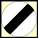
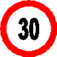
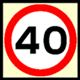
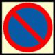
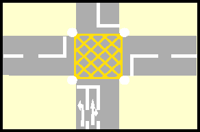

###4399 - CARS10.1

You may drive over a footpath:

1. If no pedestrians are near
2. When the pavement is very wide
3. To overtake slow-moving traffic
4. **To gain lawful access into a property**

###4489 - CARS10.2

What is the meaning of this sign?

1. No entry to vehicular traffic
2. No waiting on the carriageway
3. **National speed limit applies**
4. Local speed limit applies

###4400 - CARS10.3

What is the national speed limit outside built up areas unless otherwise indicated for cars and motorcycles?

1. 100 kph
2. 60 kph
3. **80 kph**
4. 50 kph

###4401 - CARS10.4

What is the national speed limit unless otherwise indicated on dual carriageways for cars and motorcycles?

1. 50 kph
2. 70 kph
3. **80 kph**
4. 100 kph

###4490 - CARS10.5

You see this sign ahead of you. It means:

1. The minimum speed limit ahead is 30 kph
2. You are leaving the 30 kph speed limit area
3. Start to slow down to 30 kph after passing it
4. **Do not exceed 30 kph after passing it**

###4491 - CARS10.6

What does a speed limit sign likethis mean?

1. The speed shown allows for various road and weather conditions
2. The speed shown is the advised maximum
3. It is safe to drive at the speed shown
4. **You must not exceed the speed shown**

###4402 - CARS10.7

You are driving along a street with parked vehicles on the left-hand side. For which three reasons should you keep your speed down?

1. **Children may run out from between the vehicles**
2. **Drivers' doors may open**
3. **Vehicles may be pulling out**
4. You may set off car alarms
5. So that oncoming traffic can see you more clearly

###4403 - CARS10.8

You meet an obstruction on your side of the road. You should:

1. Accelerate to get past first
2. **Give way to oncoming traffic**
3. Wave oncoming vehicles through
4. Drive on; it is your right of way

###4404 - CARS10.9

There is a tractor ahead of you. You wish to overtake but you are not sure if it is safe to do so. You should:

1. Speed through but flash your lights to oncoming traffic
2. Sound your horn to the slow vehicle to pull over
3. Follow another overtaking vehicle through
4. **Not overtake if you are in doubt**

###4405 - CARS10.10

Which three of the following are most likely to take an unusual course at roundabouts?

1. Bread vans
2. **Horse riders**
3. Delivery vans
4. **Long vehicles**
5. **Cyclists**
6. Estate cars

###4406 - CARS10.11

You are leaving your vehicle parked on a road. When may you leave the engine running?

1. When in a 40 kph zone
2. If the battery is flat
3. If you will be parked for less than five minutes
4. **Not on any occasion**

###4407 - CARS10.12

In which Five places must you not park or wait?

1. On the slope of a hill
2. **On the brow of a hill**
3. **In front of someone else's drive-way/ garage**
4. **Opposite a traffic island**
5. **On a dual carriageway**
6. **At a bus stop**

###4408 - CARS10.13

What is the nearest you may park your vehicle to a junction?

1. **5 meters (16 feet)**
2. 15 meters (49 feet)
3. 12 meters (39 feet)
4. 10 meters (32 feet)

###4409 - CARS10.14

You are finding it difficult to find a parking place in a busy town. You can see there is space on the zigzag lines of a zebra crossing. Can you park there?

1. Yes if you don't block people from crossing
2. Yes in order to drop off a passenger
3. No unless you stay with your car
4. **No not under any circumstances**

###4410 - CARS10.15

In which two places must you not park?

1. **At a bus stop**
2. In a one-way street
3. In a side road
4. **Near a school entrance**
5. Near a police station

###4492 - CARS10.16

What is the meaning of this sign?

1. School crossing patrol
2. **Waiting restrictions**
3. National speed limit
4. No entry

###4411 - CARS10.17

You are looking for somewhere to park your vehicle. The area is full except for spaces marked "disabled use". You can:

1. Use these spaces disabled or not
2. Park if you stay with your vehicle
3. Use these spaces when elsewhere is full
4. **Not park there unless permitted**

###4412 - CARS10.18

You are driving at night with fullbeam headlights on. A vehicle is overtaking you. You should dip your lights:

1. Only if the other driver dips his headlights
2. Before the vehicles starts to pass you
3. Some time after the vehicles has passed you
4. **As soon as the vehicle passes you**

###4413 - CARS10.19

You are driving on a two-lane carriageway. For which two of the following would you use the righthand lane?

1. **Overtaking**
2. Mending punctures
3. Constant high speed driving
4. Driving at the minimum allowed speed
5. **Turning right**
6. Normal driving

###4414 - CARS10.20

You are entering an area of roadworks. There is a temporary speed limit displayed. You must:

1. **Not exceed the speed limit**
2. Obey the limit except for overnight
3. Accept the speed limit as advisable
4. Obey the limit only during rush hour

###4415 - CARS10.21

You are approaching a busy junction. There are several lanes with road markings. At the last moment you realise that you are in the wrong lane. You should:

1. **Continue in that lane**
2. Use clear arm signals to cut across
3. Stop until the area has cleared
4. Force your way across

###4416 - CARS10.22

Where may you overtake on a oneway street?

1. Only on the right-hand side
2. Overtaking is not allowed
3. Only on the left-hand side
4. **Either on the right or the left**

###4417 - CARS10.23

You are going along a single-track road with passing places only on the right. The driver behind wishes to overtake. You should:

1. Drive into a passing place on your right
2. Switch on your hazard warning lights
3. **Wait opposite a passing place on your right**
4. Speed up to get away from the following driver

###4418 - CARS10.24

You are on a road that is only wide enough for one vehicle. There is a car coming towards you. Which two of these would be correct?

1. Wait opposite a passing place on your left
2. Pull into a passing place if your vehicle is wider
3. Force the other driver to reverse
4. **Wait opposite a passing place on your right**
5. **Pull into a passing place on your left**
6. Pull into a passing place on your right

###4419 - CARS10.25

Signals are normally given by direction indicators and:

1. **Brake lights**
2. Interior lights
3. Fog lights
4. Side lights

###4420 - CARS10.26

When going straight ahead at a roundabout you should:

1. **Indicate left just after you pass the exit before the one you will take**
2. Indicate left when approaching the roundabout
3. Indicate right when approaching the roundabout
4. Not indicate at any time

###4421 - CARS10.27

Which vehicle might have to use a different course than normal at roundabouts?

1. Estate car
2. Van
3. Sports car
4. **Long vehicle**

###4422 - CARS10.28

You are going straight ahead at a roundabout. How should you signal?

1. Signal right on the approach and then left to leave the roundabout
2. Signal left on the approach to the roundabout and keep the signal on until you leave
3. Signal left as you leave the roundabouts
4. **Signal left just after you pass the exit before the one you will take**

###4423 - CARS10.29

At a crossroads there are no signs or road markings. Two vehicles approach. Which has priority?

1. **Neither vehicle**
2. Vehicles approaching from the right
3. The vehicle on the widest road
4. The fastest vehicle

###4424 - CARS10.30

Who has priority at an unmarked crossroads?

1. The driver on the wider road
2. **No one**
3. The driver who is going faster
4. The driver of the larger vehicle

###4425 - CARS10.31

You are intending to turn right at a junction. An oncoming driver is also turning right. It will normally be safer to:

1. **Keep the other vehicle to your right and turn behind it (offside to offside)**
2. Hold back, wait for the other driver to turn first
3. Carry on and turn at the next junction instead
4. Keep the other vehicle to your left and turn in front of it (nearside to nearside)

###4426 - CARS10.32

The dual carriageway you are turning right onto has a narrow central reservation. You should:

1. Emerge slightly to show your intentions
2. **Wait until the road is clear in both directions**
3. Stop in the first lane so that other vehicles give way
4. Proceed to central reservation and wait

###4427 - CARS10.33

While driving you intend to turn left into a minor road. On the approach you should:

1. Swing out wide just before turning
2. Keep in the middle of the road
3. Keep just left of the middle of the road
4. **Keep well to the left of the road**

###4428 - CARS10.34

You may only enter a box junction when:

1. You need to turn left
2. The traffic lights show green
3. **Your exit road is clear**
4. There are less than two vehicles in front of you

###4429 - CARS10.35

Someone is waiting to cross at a zebra crossing. They are standing on the pavement. You should normally:

1. Ignore them as they are still on the pavement
2. Stop before you reach the zigzag lines and let them cross
3. **Stop, let them cross and wait patiently**
4. Go on quickly before they step onto the crossing

###4430 - CARS10.36

You are on a busy main road and find that you are in a wrong direction. What should you do?

1. Make a "three point" turn in the main road
2. Make a U-turn in the main road
3. Turn into a side road on the road on the right and reverse into the main road
4. **Turn round in a side road**

###4646 - CARS10.37

You may remove your seat belt temporarily when carrying out a manoeuvre that involves:

1. **Reversing**
2. Driving slowly
3. An emergency stop
4. A hill start

###4647 - CARS10.38

You must not reverse: 

1. **For longer than necessary**
2. In a built-up area
3. Into a side road
4. For more than a car's length

###4431 - CARS10.39

You are parked in a busy high street. What is the safest way to turn your vehicle around to go the opposite way?

1. **Find a quiet side road to turn round in**
2. Do a U-turn
3. Get someone to stop the traffic
4. Drive into a side road and reverse into the main road

###4648 - CARS10.40

When you are not sure that it is safe to reverse your vehicle you should:

1. Use your horn
2. Reverse slowly
3. **Get out and check**
4. Rev your engine

###4649 - CARS10.41

You are reversing your vehicle into a side road. When would the greatest hazard to passing traffic occur?

1. After you've entered the side road
2. Just before you actually begin to manoeuvre
3. After you've completed the manoeuvre
4. **When the front of your vehicle swings out**

###4432 - CARS10.42

Why is it important for you to maintain road position.

1. **So that you are on the correct side of the road before and after turning left or right at junctions and when approaching roundabouts**
2. **So that you are always in the correct lane on a multi-lane road**
3. Staying in the lane of your choice as long as you are driving within the speed limit
4. So that nobody can overtake you if they are speeding

###4433 - CARS10.43

What lights should you use and why, when going through a tunnel?

1. No lights are necessary as tunnels have their own lighting
2. **Dipped-beam to help you see and also be clearly seen by others**
3. Hazard warning lights so nobody drives too near
4. Main-beam to see clearly where you are going

###4434 - CARS10.44

When can you overtake in a tunnel?

1. On the outside lane if the vehicle in front of you on the inner lane is not going fast enough
2. On the inside lane if the vehicle in front of me on the outside lane is not going fast enough
3. **Never under normal circumstances as overtaking in tunnels is prohibited**
4. **If a broken down vehicle or other static hazard is obstructing the lane you are driving in, after having checked and signaled correctly**

###4435 - CARS10.45

What are the maximum national speed limits for cars and motorcycles in built-up areas and elsewhere?

1. 40 kph and 70 kph
2. **50 kph and 80 kph**
3. 30 kph and 60 kph
4. 45 kph and 100 kph
