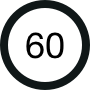
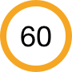

###4310  - CARS6.1

You are driving on a quiet country road. What should you expect to see coming towards you on YOUR side of the road? 

1. Horse riders 
2. Bicycles 
3. **Pedestrians** 
4. Motorcycles 

###4311  - CARS6.2

Which sign means that there may be people walking along the road? 

1.  
2.  
3. 
4. 
5. 

###4312  - CARS6.4

You are turning left into a side road and find pedestrians that are crossing. You must: 

1. Switch on your hazard lights 
2. Sound your horn
3. Wave them on
4. **Wait for them to cross**

###4313  - CARS6.5

You are turning left at a junction. Pedestrians have suddenly started to cross the road. You should: 

1. Blow your horn and proceed
2. Stop and wave at them to cross 
3. Go on giving them plenty of room 
4. **Give way to them** 

###4314  - CARS6.10

You want to emerge from a junction but your view is partly restricted by parked vehicles. What should you do? 

1. Stop get out and look along the main road to check
2. Sound your horn and pull out if there is no reply
3. Move out quickly but be prepared to stop
4. **Stop then move slowly forward until you have a clear view**

###4315  - CARS6.11

You are at the front of a queue of traffic waiting to turn right into a side road. Why is it important to check your right mirror just before turning? 

1. To check for emerging traffic
2. **To check for overtaking vehicles**
3. To make sure the side road is clear
4. To look for pedestrians about to cross 

###4316  - CARS6.13

What should a driver do at a pelican crossing when the red and amber lights are on? 

1. Move off 
2. Always wait for the green light before proceeding 
3. **Give way to any pedestrians on the crossing**
4. Signal the pedestrian to cross 

###4317  - CARS6.14

You have stopped at a pelican crossing. A disabled person is crossing slowly in front of you.The lights have now changed to green. You should: 

1. Drive in front of the person 
2. Edge forward slowly
3. **Allow the person to cross**
4. Sound your horn 
5. **Be patient** 
6. Drive behind the person 

###4318  - CARS6.15

As you approach a pelican crossing the lights change to green but elderly people are halfway across. You should: 

1. Flash your lights in case they have not heard you 
2. Rev your engine to make them hurry
3. Wave them to cross as quickly as they can 
4. **Wait because they will take longer to cross**

###4319  - CARS6.16

Look at this picture. What is the danger you should be most aware of? 

1. The car on the left may move off
2. The driver of the ice cream van may get out 
3. The ice cream van may move off 
4. **The child may run out into the road**

###4320  - CARS6.17

You are driving past parked cars. You notice a wheel of a bicycle sticking out between them. What should you do? 

1. Brake sharply and flash your headlights 
2. Slow down and wave the cyclist across 
3. Accelerate past quickly and sound your horn 
4. **Slow down and be prepared to stop for a cyclist**

###4321  - CARS6.18

You are driving past a lane of parked cars and you notice a ball bouncing out into the road ahead. What should you do? 

1. Stop and wave the children across to fetch their ball 
2. Continue driving at the same speed and flash your headlights 
3. **Slow down and be prepared to stop for children** 
4. Continue driving at the same speed and sound your horn 

###4322  - CARS6.19

If you are following a car driven by an elderly driver you should: 

1. Stay close behind and drive carefully
2. Flash your lights and overtake
3. **Be aware that the driver's reactions may not be as fast as yours**
4. Expect the driver to drive badly 

###4323  - CARS6.20

Which sign tells you that pedestrians may be walking in the road as there is no pavement? 

1. 
2. 
3. 
4. 

###4324  - CARS6.21

Which sign means there maybe elderly pedestrians likely to cross the road? 

1. 
2. 
3. 
4. 

###4325  - CARS6.22

If you see a pedestrian carrying a white stick, this shows that the person is: 

1. Elderly 
2. Deaf 
3. Disabled 
4. **Blind** 

###4326  - CARS6.23

You are driving towards a pedestrian (zebra) crossing. Waiting to cross is a person in a wheelchair. You should: 

1. Wave to the person to wait 
2. Wave to the person to cross 
3. Continue on your way 
4. **Be prepared to stop**

###4327  - CARS6.24

What action should you take when elderly people are crossing the road? 

1. Tap the horn in case they are hard of hearing 
2. **Be patient and allow them to cross in their own time**
3. Rev the engine to let them know that you are waiting 
4. Wave them across so they know that you have seen them 

###4328  - CARS6.27

You should NEVER attempt to overtake a cyclist: 

1. **Just before you turn left** 
2. On a dual carriageway 
3. On a one-way street 
4. Just before you turn right 

###4329  - CARS6.28

If you are driving behind a cyclist and you wish to turn left just ahead. You should: 

1. Go around the cyclist on the junction 
2. Pull alongside the cyclist and stay level until after the junction 
3. **Hold back until the cyclist has passed the junction** 
4. Overtake the cyclist before the junction 

###4330  - CARS6.29

You are coming up to a roundabout and a cyclist is signaling to turn right. What should you do: 

1. Signal the cyclist to move across 
2. Give a horn warning 
3. Overtake on the right 
4. **Give the cyclist plenty of room** 

###4331  - CARS6.30

You are driving behind three cyclists. They approach a roundabout in the left-hand lane. In which direction should you expect the cyclists to go? 

1. Straight ahead 
2. Right 
3. **Any direction** 
4. Left 

###4332  - CARS6.31

You are approaching a roundabout and see a cyclist signal right. Why is the cyclist keeping to the left? 

1. The cyclist thinks The highway Code does not apply to bicycles
2. The cyclist is going to turn left instead
3. It is quicker route for cyclist 
4. **The cyclist is slower and more vulnerable** 

###4333  - CARS6.32

When you are overtaking a cyclist in the road you should leave as much room as you would give to a car. What is the main reason for this? 

1. The cyclist might have to make a right turn 
2. The cyclist might get off the bike
3. The cyclist might change lanes 
4. **The cyclist might swerve** 

###4334  - CARS6.38

Where should you take particular care to look out for motorcyclists and cyclists? 

1. On one-way streets 
2. **At junctions**
3. At zebra crossings
4. On dual carriageways 

###4335  - CARS6.39

In daylight an approaching motorcyclist is using a dipped headlight. Why? 

1. **So that the rider can be seen more easily**
2. The rider is inviting you to proceed
3. To improve the rider's vision
4. To stop the battery overcharging 

###4336  - CARS6.42

You are driving behind a moped or a small motorcycle. You want to turn left just ahead. You should: 

1. Sound your horn as a warning and pull in front of the moped 
2. Pull alongside the moped and stay level until just before the junction
3. Overtake the moped before the junction 
4. **Stay behind until the moped has passed the junction** 

###4337  - CARS6.44

At road junctions which THREE of the following are most vulnerable? 

1. **Motorcyclists** 
2. **Cyclists** 
3. Lorry drivers 
4. Car drivers 
5. **Pedestrians** 

###4338  - CARS6.45

When emerging from a side road into a queue of traffic which road users can be difficult to see? 

1. **Motorcycles** 
2. Cars 
3. Milk floats 
4. Tractors 

###4339  - CARS6.46

You want to turn right from a main road into a side road. Just before you turn you should: 

1. Stop and set the handbrake 
2. Select first gear 
3. **Check for traffic overtaking on your right** 
4. Cancel your right-turn signal 

###4340  - CARS6.48

You are driving and ahead of you there is a vehicle with a flashing amber beacon.This means it is: 

1. **Slow moving** 
2. A school crossing patrol 
3. A doctor's car 
4. Broken down 

###4341  - CARS6.50

An injured motorcyclist is lying unconscious in the road. You should: 

1. Remove the leather jacket 
2. Move the person off the road 
3. Remove the safety helmet 
4. **Seek medical assistance**

###4342  - CARS6.51

You are driving in town. There is a bus at the bus stop on the other side of the road. Why should you be careful? 

1. The bus may remain stationary 
2. The bus may move off suddenly 
3. The bus may have broken down 
4. **Pedestrians may come from behind the bus** 

###4343  - CARS6.52

How should you overtake horse riders? 

1. Use your horn just once to warn them 
2. Speed is not important but allow plenty of room 
3. Drive along their side and overtake as soon as possible 
4. **Drive slowly and leave plenty of room** 

###4344  - CARS6.53!!!

You notice horse riders ahead of you. What should you do FIRST? 

1. Signal right 
2. **Be prepared to slow down** 
3. Accelerate around them 
4. Pull out to the middle of the road 

###4345  - CARS6.54

You are driving on a narrow country road. Where would you find it most difficult to see horses and riders ahead of you? 

1. **On left-hand bends** 
2. On right-hand bends 
3. When uphill 
4. When downhill 

###4346  - CARS6.55

A horse rider is in the left-hand lane approaching a roundabout. The driver behind should expect the rider to: 

1. Go ahead 
2. Turn left 
3. Turn right 
4. **Go in any direction **

###4347  - CARS6.56

You are approaching a roundabout. There are horses just ahead of you. You should: 

1. Sound your horn as a warning
2. **Give them plenty of room**
3. Accelerate past as quickly as possible 
4. Treat them like any other vehicle 
5. **Be prepared to stop**

###4348  - CARS6.57

You see a group of horse riders as you approach a roundabout. They are signalling to go right but keeping well to the left. You should: 

1. Cut in front of them
2. Keep close of them
3. Proceed as normal
4. **Stay well back**

###4349  - CARS6.58

What is the MOST common cause
 of road accidents? 

1. Mechanical failure 
2. **Driver error**
3. Road conditions 
4. Weather conditions 

###4350  - CARS6.60

Which age group is most likely to be involved in traffic accidents? 

1. 46 to 55-year-old 
2. 55-year-olds and over 
3. 36 to 45-year-old 
4. **18 to 25-year-old** 

###4351  - CARS6.1

You are following a learner driver who stalls at a junction. What should you do? 

1. **Be patient as you expect them to make mistakes** 
2. Immediately steer around them and drive on
3. Start to rev your engine if they take too long to restart 
4. Drive up close behind and flash your headlights

###4620 - CARS6.47

Which of the following are hazards that motorcyclists present in queues of traffic?

1. **Passing very close to your car**
2. Riding with their headlamp on dipped beam
3. Riding in single file
4. **Filtering between the lanes**
5. **Cutting in just in front of you**

###4621 - CARS6.49

You are driving in slow-moving queues of traffic. Just before changing lane you should:

1. Change down to first gear
2. Give a 'slowing down' arm signal
3. Sound the horn
4. **Look for motorcyclists filtering through the traffic**

###4622 - CARS6.59

You have a collision while your car is moving. What is the first important thing you must do?

1. Call your insurance company
2. Call the emergency services
3. **Stop at the scene of the accident**
4. Stop only if there are injured people

###4623 - CARS6.62

If a friend wants to teach you how to drive a car they must:

1. **Be over 25 and have held a full licence for at least 5 years**
2. Be over 21 and have had a full license for at least three years.
3. Be over 18 and have fully comprehensive insurance
4. Be over 18 and hold an advanced driver's certificate

###4624 - CARS6.63

Your car hits a pedestrian at 60 kph. The pedestrian will:

1. Probably survive
2. Certainly survive
3. **Probably be killed**
4. Certainly be killed

###4625 - CARS6.64

You are dazzled at night by the lights of the vehicle behind you. You should:

1. **Set your mirror to anti-dazzle**
2. Switch your rear lights on and off
3. Brake sharply to a stop
4. Set your mirror to dazzle the other driver

###4613 - CARS6.26

You are following a motorcyclist on an uneven road. You should:

1. Allow the same room as normal because motorcyclists are not affected by road surfaces
2. Overtake immediately
3. **Allow extra room in case they swerve to avoid pot-holes**
4. Allow less room to ensure that you can be seen in their mirrors

###4614 - CARS6.33

Which TWO should you allow extra room when overtaking?

1. Road-sweeping vehicles
2. **Motorcycles**
3. Tractors
4. **Bicycles**

###4615 - CARS6.34

Why should you allow extra room when overtaking a motorcyclist on a windy day?

1. The rider may be traveling faster than normal
2. **The rider may be blown across in front of you**
3. The rider may stop suddenly
4. The rider may turn off suddenly to get out of the wind

###4616 - CARS6.35

Which type of vehicle is MOST affected by strong winds?

1. Bowser
2. **Motorcycle**
3. Car
4. Tractor

###4617 - CARS6.36

Why should you particularly look for motorcyclists and cyclists at any junction?

1. They might not see you turn
2. They may slow down to let you turn
3. **They are harder to see**
4. They may want to turn into the side road

###4618 - CARS6.37

You are waiting to come out of a side road. Why should you watch carefully for motorcycles?

1. Motorcycles have right of way
2. Police patrols often use motorcycles
3. **Motorcycles are small and hard to see**
4. Motorcycles are usually faster than cars

###4619 - CARS6.43

Motorcyclists often look round over their right shoulder just before turning right. This is because:

1. Looking around helps them balance as they turn
2. Motorcycles do not have mirrors
3. They need to listen for following traffic
4. **They need to check for traffic in their blind area**

###4607 - CARS6.6

You want to reverse into a side road. You are not sure that the area behind your car is clear. What should you do?

1. Carry on assuming it is clear
2. **Get out and check**
3. Check the mirrors only
4. Look through the rear window only

###4608 - CARS6.7

You are about to reverse into a side road and a pedestrian wishes to cross behind you. You should:

1. Reverse before the pedestrian starts to cross
2. **Give way to the pedestrian**
3. Wave to the pedestrian to cross
4. Wave to the pedestrian to stop

###4609 - CARS6.8

Who is especially in danger of not being seen as you reverse your car?

1. Cyclists
2. Car drivers
3. Motorcyclists
4. **Children**

###4610 - CARS6.9

You intend to turn right into a side road. Just before turning you should check for motorcyclists who may be:

1. Emerging from the side road
2. Following you closely
3. Overtaking on your left
4. **Overtaking on your right**

###4611 - CARS6.12

In which three places would parking cause an obstruction to other road users?

1. Where the kerb is raised
2. **At or near a bus stop**
3. **Where the kerb has been lowered for wheelchairs**
4. **Near the brow of a hill**
5. In a lay-by

###4612 - CARS6.25

You are following a motorcyclist on an uneven and bumpy road. You should:

1. Stop and wave them across the road
2. Speed up to get past them quickly
3. Expect them to wait for you to pass
4. **Be careful they may misjudge your speed**
