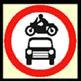

###7192 - BIKEH11.11

Which sign has an octagon shape ?

1.  **Stop sign** 
2.  No entry 
3.  Give way 
4.  Speed limit zone 

###7193 - BIKEH11.12

What does this sign mean?

1.  Two-way traffic 
2.  No motor vehicles 
3.  You have priority 
4.  **No overtaking** 

###7194 - BIKEH11.13

What does this sign mean?

1.  Form two lanes 
2.  **Do not overtake** 
3.  Give way to oncoming traffic 
4.  Keep in one lane 

###7195 - BIKEH11.14

What does this sign mean?

1.  **Waiting restrictions apply** 
2.  Clearway (no stopping) 
3.  National speed limit applies 
4.  Waiting permitted

###7196 - BIKEH11.15

Which sign means 'no stopping'?

1. 
2. 
3. 
4. 

###7197 - BIKEH11.16

What does this sign mean?

1.  **No stopping** 
2.  No entry 
3.  Crossroads 
4.  Roundabout 

###7198 - BIKEH11.17

You see this sign ahead. It means

1.  No stopping 
2.  **No entry** 
3.  Waiting restrictions apply 
4.  National speed limit applies 

###7199 - BIKEH11.18

What does this traffic sign mean?

1.  **Give priority to oncoming traffic** 
2.  One-way traffic only 
3.  Two way traffic 
4.  No overtaking allowed 

###7200 - BIKEH11.19

What is the meaning of this traffic sign?

1.  Bus lane ahead 
2.  Give priority to vehicles coming towards you 
3.  **You have priority over vehicles coming towards you** 
4.  End of two-way road 

###7201 - BIKEH11.2

Traffic signs giving orders are generally which shape?

1.  **Round** 
2.  Octagonal 
3.  Square 
4.  Triangle

###7202 - BIKEH11.20

Which sign warns you that a Zebra crossing is on the approach?

1. 
2. 
3. 
4. 

###7203 - BIKEH11.21

What MUST you do when you see this sign?

1.  Stop ONLY if a red light is showing 
2.  Stop ONLY if children are waiting to cross 
3.  Stop ONLY if traffic is approaching 
4.  **Stop even if the road is clear** 

###7204 - BIKEH11.22

What does this sign mean?

1.  **No overtaking** 
2.  Two-way traffic ahead 
3.  One-way street 
4.  Overtaking is permissible 

###7205 - BIKEH11.23

What is the shape of a GIVE-WAY sign at a junction?

1.  SQUARE 
2.  **TRIANGULAR** 
3.  DIAMOND 
4.  ROUND 

###7206 - BIKEH11.24

What colour is the background of an indication sign?

1.  RED 
2.  **BLUE** 
3.  BROWN 
4.  WHITE 

###7207 - BIKEH11.25

At a roundabout you should

1.  **Give way to traffic from the right** 
2.  Stop even when clear 
3.  Give way to traffic from the other way 
4.  Give way to traffic from the left

###7208 - BIKEH11.26

What does this sign mean?

1.  **Pass either side** 
2.  Turn off at the next available junction 
3.  Approaching traffic passes you on both sides 
4.  Give way to oncoming vehicles 

###7209 - BIKEH11.27

What does a circular traffic sign with a blue background do?

1.  Give motorway information 
2.  Give directions to a car park 
3.  Give warning of a motorway ahead 
4.  **Give an instruction** 

###7210 - BIKEH11.28

Which of these signs means that you are entering a one-way street?

1. 
2. 
3. 
4. 

###7213 - BIKEH11.30

What are triangular signs for?

1.  **To give warnings** 
2.  To give directions 
3.  To give order 
4.  To give information 

###7214 - BIKEH11.31

What does this sign means?

1.  **T-junction** 
2.  Give way 
3.  No through road 
4.  Turn left ahead 

###7215 - BIKEH11.32

What does this sign mean?

1.  **Crossroads** 
2.  Ahead only 
3.  Level crossing without gate 
4.  Level crossing with a gate

###7216 - BIKEH11.33

What does this sign mean?

1.  Ring road 
2.  No stopping 
3.  No vehicles 
4.  **Roundabout** 

###7217 - BIKEH11.34

Which FOUR of these would be indicated by a triangular road sign?

1.  **Give-way** 
2.  **Children crossing** 
3.  **Roundabout** 
4.  **Road narrows** 
5.  Minimum speed 
6.  Ahead only 

###7219 - BIKEH11.36

Which of these signs warn you of a pedestrian crossing?

1. 
2. 
3. 
4. 

###7220 - BIKEH11.37

What does this sign mean?

1.  No footpath ahead 
2.  Pedestrians only ahead 
3.  Pedestrian crossing ahead 
4.  School crossing ahead 

###7223 - BIKEH11.4

What does this sign mean?

1.  **Maximum speed limit with traffic calming** 
2.  Only 20 cars allowed at any one time 
3.  20 cars only 
4.  Minimum speed limit with traffic calming 

###7224 - BIKEH11.40

What does this sign mean?

1.  Humpback bridge 
2.  **Hump in the road** 
3.  Entrance to tunnel 
4.  Soft verges

###7225 - BIKEH11.41

What does this sign mean?

1.  **Tunnel ahead** 
2.  Accident black spot ahead 
3.  Ancient monument ahead 
4.  Low bridge ahead 

###7226 - BIKEH11.42

Which of these signs means that the road will narrow on both sides?

1. 
2. 
3. 
4. 

###7227 - BIKEH11.43

What does this sign mean?

1.  End of dual carriageway 
2.  End of a bridge 
3.  **No through road (Dead end)** 
4.  T-junction 

###7228 - BIKEH11.44

What does this sign mean?

1.  **Two-way traffic ahead** 
2.  Motorway contra flow system ahead 
3.  Traffic approaching you has priority 
4.  Two-way traffic ahead across a one-way street 

###7229 - BIKEH11.45

What does this traffic sign mean?

1.  **Danger ahead** 
2.  Service area ahead 
3.  Tyres liable to punctures ahead 
4.  Slippery road ahead 

###7230 - BIKEH11.46

You are about to overtake an other vehicle, when you see this ROAD MARKING. You should

1.  **Keep to the left** 
2.  Switch your headlights on before overtaking 
3.  Move right to get a better view 
4.  Overtake the other driver as quickly as possible

###7231 - BIKEH11.47

What does this sign mean?

1.  **Steep hill downwards** 
2.  Steep hill upwards 
3.  Uneven road 
4.  Camber in the road 

###7232 - BIKEH11.48

What does this sign mean?

1.  **Quayside** 
2.  Road liable to flooding 
3.  Slippery road 
4.  Steep hill downwards 

###7233 - BIKEH11.49

What does this sign mean?

1.  **No through road on the left** 
2.  Turn left for bus terminal 
3.  No entry for traffic turning left 
4.  Turn left for parking area 

###7234 - BIKEH11.5

Which sign means no vehicles are allowed?

1. 
2. 
3. 
4. 

###7235 - BIKEH11.50

What does this sign mean?

1.  Toilet ahead 
2.  Telephone box ahead 
3.  T-junction 
4.  **No through road**

###7236 - BIKEH11.51

Which sign means 'no through road'?

1. 
2. 
3. 
4. 

###7237 - BIKEH11.52

What is the meaning of the following sign ?

1.  **No motorcycles** 
2.  Only motorcycles 
3.  No overtaking 
4.  Light vehicles only 

###7238 - BIKEH11.53

What does this sign mean?

1.  The right-hand lane ahead is narrow 
2.  Right-hand lane for buses only 
3.  Right hand lane for turning right 
4.  **The right-hand lane ahead is closed** 

###7239 - BIKEH11.54

You see this traffic light ahead. Which light(s) will come on next?

1.  **Red alone** 
2.  Red and amber together 
3.  Green and amber together 
4.  Green alone 

###7240 - BIKEH11.55

You are approaching a red traffic light. The signal will change from red to

1.  **Red and amber then green** 
2.  Green and amber then green 
3.  Amber then green 
4.  Green then amber 

###7241 - BIKEH11.56

A red traffic light means

1.  Proceed with caution 
2.  Stop if you are able to brake safely 
3.  **You must stop and wait behind the stop line** 
4.  You should stop unless turning left

###7242 - BIKEH11.57

At traffic lights amber on its own means

1.  Go if no pedestrians are crossing 
2.  Go if the way is clear 
3.  Prepare to go 
4.  **Stop because the light will change to red** 

###7243 - BIKEH11.58

A red traffic light means

1.  **You must stop behind the white stop line** 
2.  You must slow down and prepare to stop if traffic has started to cross 
3.  You may turn left if it is safe to do so 
4.  You may drive straight on if there is no other traffic 

###7244 - BIKEH11.59

You are approaching traffic lights. Red and amber are showing. This means

1.  The lights are about to change to red 
2.  There is a fault with the lights - take care 
3.  **Wait for the green light before you pass the lights** 
4.  Pass the lights if the road is clear 

###7245 - BIKEH11.6

Which of these signs means no powered vehicles?

1. 
2. 
3. 
4. 

###7246 - BIKEH11.60

You are at a junction controlled by traffic lights. When should you NOT proceed at green?

1.  When you intend to turn right 
2.  **When your intended route from the junction is blocked** 
3.  When you think the lights may be about to change 
4.  When pedestrians are waiting to cross 

###7247 - BIKEH11.61

What do these zigzag lines at pedestrian crossings mean?

1.  **No parking at any time** 
2.  Sounding horns is not allowed 
3.  Slow down to 20kph 
4.  Parking allowed only for a short time

###7248 - BIKEH11.62

This marking appears on the road just before a

1.  No entry sign 
2.  **Give way sign** 
3.  Stop sign 
4.  No through road sign 

###7249 - BIKEH11.63

You see this line across the road at the entrance to a roundabout. What does it mean?

1.  **Give way to traffic from the right** 
2.  Stop at the line 
3.  You have right of way 
4.  Traffic from the left has right of way 

###7250 - BIKEH11.64

The driver of the car in front is giving this signal. What does it mean?

1.  **The drivers intends to turn left** 
2.  The driver intends to turn right 
3.  The driver wishes to overtake 
4.  The driver is slowing down 

###7251 - BIKEH11.65

The driver of this car is giving an arm signal. What is he about to do?

1.  **Slow down** 
2.  Go straight ahead 
3.  Turn to the left 
4.  Turn to the right 

###7252 - BIKEH11.66

You are to turn right in busy traffic. How would you confirm your intention safely?

1.  **Give an arm signal and use your signals correctly** 
2.  Position over the centre line at an angle 
3.  Flash your headlamp 
4.  Sound the horn 

###7253 - BIKEH11.67

You want to turn right at a junction but you think that your indicators cannot be seen clearly. What should you do?

1.  **Give an arm signal as well as an indicator signal** 
2.  Keep well over to the right 
3.  Stay in the left-hand lane 
4.  Get off and check if your indicators can be seen 

###7254 - BIKEH11.68

When may you sound the horn on your vehicle?

1.  To make slower drivers move over 
2.  To attract a friend's attention 
3.  **To warn others of your presence** 
4.  To give you right of way 

###7255 - BIKEH11.69

Why should you make sure that you have cancelled your indicators after turning?

1.  To avoid damage to the indicator relay 
2.  **To avoid misleading other road users** 
3.  To avoid dazzling other road users 
4.  To avoid flattening the battery

###7256 - BIKEH11.7

What does this sign mean?

1.  Minimum speed limit 30kph 
2.  No vehicles over 30 tonnes 
3.  **NEW speed limit 30 kph** 
4.  End of 30kph zone 

###7257 - BIKEH11.70

You are waiting at a T-junction. A vehicle is coming from the right with the left signal flashing. What should you do?

1.  Move out slowly 
2.  Pull out before the vehicle reaches the junction 
3.  **Wait until the vehicle starts to turn in** 
4.  Move out and accelerate hard 

###7258 - BIKEH11.71

Which of these signs means that the national speed limit applies?

1. 
2. 
3. 
4. 

###7259 - BIKEH11.72

What is the meaning of these road markings?

1.  Continuous cum broken white lines intended to separate two opposing streams of traffic 
2.  **You may overtake only when you have the broken lines on your side as long as no traffic is coming** 
3.  Hatched traffic stream separator warning lines that may be used for overtaking as long as no traffic is coming 
4.  Central reservation and can be used for overtaking if no traffic is coming from the opposite direction. 

###7260 - BIKEH11.73

What is the maximum speed limit in a built up area unless indicated otherwise?

1.  60kph 
2.  40kph 
3.  **50kph** 
4.  30 kph

###7261 - BIKEH11.74

What do these road markings mean?

1.  Continuous double white line may be crossed only when overtaking. 
2.  **Continuous double white line which vehicles must not drive over or across** 
3.  Continuous double white line mark the lanes and guides the traffic flow 
4.  No stopping or parking is permitted where a continuous double white line is present 

###7262 - BIKEH11.8

What does this sign mean?

1.  One way traffic only 
2.  **You have priority over oncoming traffic** 
3.  Drive forward 
4.  Oncoming traffic has priority over you 

###7263 - BIKEH11.9

What does this sign mean?

1.  No through road 
2.  No road markings 
3.  No parking 
4.  **No entry** 

