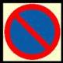
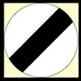

###7149 - BIKEH10.1

You may drive over a footpath

1.  **To gain lawful access into a property** 
2.  If no pedestrians are near 
3.  When the pavement is very wide 
4.  To overtake slow-moving traffic 

###7150 - BIKEH10.10

Which three of the following are most likely to take an unusual course at roundabouts?

1.  **Cyclists** 
2.  **Long vehicles** 
3.  **Horse riders** 
4.  Small cars 
5.  Delivery vans 
6.  Bread vans

###7151 - BIKEH10.11

You are leaving your motorcycle parked on a road. When may you leave the engine running?

1.  **Never** 
2.  When in a 20 km/h zone 
3.  If the battery is flat 
4.  If you will be parked for less than five minutes 

###7152 - BIKEH10.12

In which FOUR places must you NOT park or wait?

1.  **On the brow of a hill** 
2.  **On a zebra crossing** 
3.  **Opposite a traffic island** 
4.  **At a bus stop** 
5.  On the slope of a hill 
6.  On a dual carriageway 

###7153 - BIKEH10.13

What is the nearest you may park your vehicle to a junction?

1.  **5 meters   (16 feet)** 
2.  15 meters (49 feet) 
3.  12 meters (39 feet) 
4.  10 meters (32 feet) 

###7154 - BIKEH10.14

Can you park on the zigzag lines of a zebra crossing?

1.  **No not under any circumstances** 
2.  Yes if you don't block people from crossing 
3.  Yes in order to drop off a passenger 
4.  Yes unless you stay in your car 

###7155 - BIKEH10.15

In which TWO places must you NOT park?

1.  **On a bus stop** 
2.  In a one-way street 
3.  In a side road 
4.  **Near a school entrance** 
5.  Near a police station 

###7156 - BIKEH10.16

What is the meaning of this sign?

1.  No entry 
2.  **Waiting restrictions** 
3.  National speed limit 
4.  School crossing patrol 

###7157 - BIKEH10.17

You are looking for somewhere to park your vehicle. The area is full EXCEPT for spaces marked 'disabled use'. You can

1.  Use these spaces disabled or not 
2.  Park if you stay with your vehicle 
3.  Use these spaces when elsewhere is full 
4.  **Not park there unless permitted** 

###7158 - BIKEH10.18

You are driving at night with full-beam headlights on. A vehicle is overtaking you. You should dip your lights

1.  **As soon as the vehicle passes you** 
2.  Only if the other driver dips his headlights 
3.  Before the vehicles starts to pass you 
4.  Some time after the vehicles has passed you

###7160 - BIKEH10.2

What is the meaning of this sign?

1.  No entry 
2.  **National speed limit applies** 
3.  No waiting on the carriageway 
4.  A 60 km/h speed limit applies 

###7161 - BIKEH10.20

You are entering an area of roadworks. There is a temporary speed limit displayed.

1.  **Do not exceed the speed limit** 
2.  Obey the speed limit except for the night 
3.  Obey the speed limit only during working hours 
4.  Obey the speed limit only during the rush hour 

###7162 - BIKEH10.21

You are approaching a busy junction. There are several lanes with road markings. At the last moment you realise that you are in the wrong lane. You should

1.  Use clear arm signals to cut across 
2.  Stop until the area has cleared 
3.  Force your way across 
4.  **Continue in that lane** 

###7163 - BIKEH10.22

On a one-way street with two lanes, from which side can you pass a vehicle?

1.  **Either on the right-hand lane or the left-hand lane** 
2.  Only on the right-hand lane 
3.  Passing in a one-way street is not allowed 
4.  Only on the left-hand lane 

###7164 - BIKEH10.23

You are riding on a single lane road in the country, with passing places only on the right. The driver behind you wishes to overtake. You should

1.  **Wait opposite a passing place on your right** 
2.  Drive into a passing place on your right 
3.  Switch on your hazard warning lights 
4.  Speed up to get away from the following driver 

###7165 - BIKEH10.24

You are on a road that is only wide enough for one car. There is a car coming towards you. Which TWO of these would be correct?

1.  **Wait opposite a passing place on your right** 
2.  **Pull into a passing place on your left** 
3.  Wait opposite a passing place on your left 
4.  Pull into a passing place if your vehicle is wider 
5.  Force the other driver to reverse 
6.  Pull into a passing place on your right 

###7166 - BIKEH10.25

Signals are normally given by direction indicators and

1.  **Brake lights** 
2.  Interior lights 
3.  Fog lights 
4.  Side lights 

###7167 - BIKEH10.26

When going straight ahead at a roundabout you should

1.  **Indicate left before leaving the roundabout** 
2.  Indicate left when approaching the roundabout 
3.  Indicate right when approaching the roundabout 
4.  Not indicate at any time

###7168 - BIKEH10.27

Which vehicle might have to use a different course than normal at roundabouts?

1.  **Long vehicle** 
2.  Estate car 
3.  Van 
4.  Sports car 

###7169 - BIKEH10.28

You are going straight ahead towards the second exit at a roundabout. How should you signal?

1.  **Signal left just after you pass the exit before the one you will take** 
2.  Signal left on the approach to the roundabout and keep the signal on until you leave 
3.  Signal left after you leave the roundabouts 
4.  Signal right on the approach and then left to leave the roundabout 

###7170 - BIKEH10.29

At a crossroads there are no signs or road markings. Two vehicles approach. Which has priority?

1.  **Neither vehicle** 
2.  Vehicles approaching from the right 
3.  The vehicle on the widest road 
4.  The fastest vehicle 

###7171 - BIKEH10.3

What are the national speed limits  for motorcycles?

1.  100kph 
2.  **80kph** 
3.  60kph 
4.  **50kph** 

###7172 - BIKEH10.30

Who has priority at an unmarked crossroads?

1.  The driver on the wider road 
2.  **No one** 
3.  The driver who is going faster 
4.  The driver of the larger vehicle 

###7173 - BIKEH10.31

You are intending to turn right at a junction. An oncoming driver is also turning right. What should you do?

1.  **Keep the other vehicle to your RIGHT and turn behind it (offside to offside)** 
2.  Hold back wait for the other driver to turn first 
3.  Carry on and turn at the next junction instead 
4.  Keep the other vehicle to your LEFT and turn in front of it (nearside to nearside) 

###7174 - BIKEH10.32

The dual carriageway you are turning right onto has a central reservation. You should

1.  Wait until the road is clear in both directions 
2.  Emerge slightly to show your intentions 
3.  Stop in the first lane so that other vehicles give way 
4.  **Proceed to central reservation and wait** 

###7175 - BIKEH10.33

While driving you intend to turn left into a minor road. On the approach you should

1.  **Keep well to the left of the road** 
2.  Swing out wide just before turning 
3.  Keep in the middle of the road 
4.  Keep just left to the middle of the road

###7176 - BIKEH10.34

You may only enter a box junction when

1.  You need to turn left 
2.  **Your exit road is clear** 
3.  The traffic lights show green 
4.  There are less than two vehicles in front of you 

###7177 - BIKEH10.35

Pedestrians are waiting on the pavement to cross at a zebra crossing, You should

1.  **Stop, let them cross and wait patiently** 
2.  Ignore them as they are still on the pavement 
3.  Stop before you reach the zigzag lines and let them cross 
4.  Go on quickly before they step onto the crossing 

###7178 - BIKEH10.36

You are on a busy main road and you find that you are travelling in the wrong direction. What should you do?

1.  **Turn round in a side road** 
2.  Make a three point turn 
3.  Make a U-turn 
4.  Turn into a side road on the right and reverse to the main road 

###7179 - BIKEH10.39

You are parked in a busy street. What is the safest way to turn your motorcycle around.

1.  **Find a quiet side road to turn round in** 
2.  Do a U-turn 
3.  Get someone to stop the traffic 
4.  Drive into a side road and reverse into the main road 

###7182 - BIKEH10.43

What lights should you use, and why should you must put them on when going through a tunnel?

1.  **Dipped-beam to help you see and also be clearly seen by others.** 
2.  No lights are necessary as tunnels have their own lighting. 
3.  Hazard warning lights so nobody drives too near. 
4.  Dipped-beam and front and/or rear Fog lights to see and be seen clearly. 
5.  Main-beam to see clearly where you are going. 

###7183 - BIKEH10.44

When can you overtake in a tunnel?

1.  Never as overtaking under tunnels is prohibited. 
2.  In case of heavy rain fall 
3.  **Only if a broken down vehicle is obstructing the lane you are driving on** 
4.  If the vehicle in front of  you is not going fast enough. 

###7184 - BIKEH10.45

What is the national speed limit in built up areas?

1.  **50kph** 
2.  40kph 
3.  30kph 
4.  45kph 

###7185 - BIKEH10.5

What is the meaning of a white sign, showing a bold black number 30,  in a red circle?

1.  **Do not exceed 30 kph after passing it** 
2.  The minimum speed limit ahead is 30 kph 
3.  You are leaving a 30 kph speed limit area 
4.  You can drive at an average speed of 30 kph

###7186 - BIKEH10.6

What does a speed limit sign like this mean?

1.  **You must not exceed the speed shown** 
2.  The speed shown must be followed only in case of bad weather conditions 
3.  The speed shown is the advised maximum speed you can use in case of an accident 
4.  It is safe to drive at the speed shown only during the day 

###7187 - BIKEH10.7

You are driving along a street with parked vehicles on the left-hand side. For which THREE reasons should you keep your speed down?

1.  You may set off car alarms 
2.  So that oncoming traffic can see you more clearly 
3.  **Children may run out from between the vehicles** 
4.  **Drivers' doors may open** 
5.  **Vehicles may be pulling out** 
6.  Vehicles may be approaching 

###7188 - BIKEH10.8

You meet an obstruction on your side of the road. You should

1.  Drive on; it is your right of way 
2.  **Give way to oncoming traffic** 
3.  Wave oncoming vehicles to pass through 
4.  Accelerate to pass first 

###7189 - BIKEH10.9

There is a tractor ahead of you. You wish to overtake but you are NOT sure if it is safe to do so. You should

1.  **Not overtake if you are in doubt** 
2.  Speed through, but flash your lights to the oncoming traffic 
3.  Sound your horn while overtaking 
4.  Make an arm signal while overtaking 

