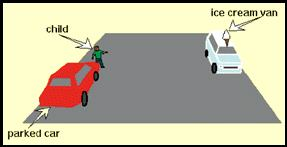

###7420 - BIKEH6.1

You should not drive closely behind a truck

1.  To avoid exhaust smoke 
2.  To avoid air resistance 
3.  As you might not be visible to other road users 
4.  **As you will have a poor vision of what is coming ahead** 

###7421 - BIKEH6.10

You want to turn from a junction but your view is partly restricted by parked vehicles. What should you do?

1.  **Stop then move slowly forward until you have a clear view** 
2.  Move out quickly but be prepared to stop 
3.  Sound your horn and pull out

###7423 - BIKEH6.13

What should a rider do at a pelican crossing when the red and amber lights are on?

1.  Wait for the red-and-amber light, before proceeding 
2.  Give way to any pedestrians on the crossing 
3.  **Always wait for the green light before proceeding** 
4.  Signal the pedestrian to cross 

###7424 - BIKEH6.14

You have stopped at a pelican crossing. A disabled person is crossing slowly in front of you. The lights have now changed to green. You should

1.  Drive in front of the person 
2.  **Allow the person to cross all the way** 
3.  Edge forward slowly 
4.  Sound your horn 
5.  Drive behind the person 

###7425 - BIKEH6.15

As you approach a pelican crossing the lights change to green, but elderly people are still halfway across. You should

1.  **Wait because they will take longer to cross** 
2.  Flash your lights 
3.  Rev your engine to make them hurry 
4.  Wave them to cross as quickly as they can 

###7426 - BIKEH6.16

Look at this picture. What is the danger you should be most aware of?

1.  The car on the left may move off 
2.  The driver of the ice cream van may get out 
3.  The ice cream van may move off 
4.  **The child may run out into the road** 

###7427 - BIKEH6.17

You are driving past parked cars. You notice a wheel of a bicycle sticking out between them. What should you do?

1.  **Slow down and be prepared to stop** 
2.  Brake sharply and flash your headlights 
3.  Slow down and wave the cyclist across 
4.  Accelerate past quickly and sound your horn 

###7428 - BIKEH6.18

You are driving and you notice a ball bouncing out into the road. What should you do?

1.  Stop and wave the children to fetch their ball 
2.  **Slow down and be prepared to stop** 
3.  Continue driving at the same speed and flash your headlights 
4.  Continue driving at the same speed and sound your horn 

###7429 - BIKEH6.19

If you are following an elderly driver you should

1.  **Be aware that the driver's reactions may not be as fast as yours** 
2.  Stay close behind 
3.  Flash your lights 
4.  Expect the driver to drive badly

###7430 - BIKEH6.2

Which sign means that there may be people walking along the road?

1. {picture}
2. {picture}
3. {picture}
4. {picture}

###7431 - BIKEH6.20

Which sign tells you that pedestrians may be walking in the road as there is no pavement?

1. {picture}
2. {picture}
3. {picture}
4. {picture}

###7432 - BIKEH6.21

Which sign means there may be  elderly pedestrians likely to cross the road?

1. {picture}
2. {picture}
3. {picture}
4. {picture}

###7433 - BIKEH6.22

If you see a person with a white stick, this means that the person is

1.  Blind 
2.  Elderly 
3.  Deaf 
4.  Disabled 

###7434 - BIKEH6.23

You are driving towards a pedestrian crossing. Waiting to cross is a person in a wheelchair. You should

1.  Be prepared to stop and wait patiently 
2.  Wave to the person to wait 
3.  Wave to the person to cross 
4.  Continue on your way 

###7435 - BIKEH6.24

What action should you take when elderly people are crossing the road?

1.  Tap the horn in case they are hard of hearing 
2.  Be patient and allow them to cross in their own time 
3.  Rev the engine to let them know that you are waiting 
4.  Wave them across so they know that you have seen them 

###7436 - BIKEH6.27

You should NEVER attempt to overtake a cyclist

1.  Just before you turn left 
2.  On a dual carriageway 
3.  On a one-way street 
4.  Just before you turn right 

###7437 - BIKEH6.28

If you are driving behind a cyclist and you wish to turn left. You should

1.  Hold back until the cyclist has passed the junction 
2.  Go around the cyclist 
3.  Pull alongside the cyclist 
4.  Overtake the cyclist before the junction

###7438 - BIKEH6.29

You are coming up to a roundabout and a cyclist is signalling to turn right. What should you do

1.  Signal the cyclist to move across 
2.  Give a horn warning 
3.  Overtake on the right 
4.  Give the cyclist plenty of room 

###7439 - BIKEH6.3

You are driving along  a main road with multiple junctions. You should be alert for

1.  You may lose balance due to the wind 
2.  other road users emerging from junctions who may not see you 
3.  The road which other road users may be using is more slippery 
4.  Other road users may be driving slower at junctions 

###7441 - BIKEH6.31

You are approaching a roundabout and see a cyclist signal right. Why is the cyclist keeping to the left?

1.  The cyclist thinks The highway Code does not apply to bicycles 
2.  The cyclist is going to turn left instead 
3.  It is quicker route for cyclist 
4.  The cyclist is slower and more vulnerable 

###7442 - BIKEH6.32

When you are overtaking a cyclist on the road  you should leave as much room as you would give to a car. What is the main reason for this?

1.  The cyclist might have to make a right turn 
2.  The cyclist might get off the bike 
3.  The cyclist might change lanes 
4.  The cyclist might swerve 

###7443 - BIKEH6.38

Where should you take particular care to look out for motorcyclists and cyclists?

1.  On one-way streets 
2.  At junctions 
3.  At zebra crossings 
4.  On dual carriageways 

###7444 - BIKEH6.39

In daylight an approaching motorcyclist is using a dipped headlight. Why?

1.  So that the rider can be seen more easily 
2.  The rider is inviting you to proceed 
3.  To improve the rider's vision 
4.  To stop the battery overcharging 

###7446 - BIKEH6.40

Motorcyclists should wear bright clothing mainly because

1.  The colours are popular 
2.  It helps keep them cool in summer 
3.  They must do so by law 
4.  Other drivers can see them 

###7447 - BIKEH6.41

Motorcyclists ride in day light with their headlights switched on because

1.  They need to be seen 
2.  There are pot holes in the road 
3.  There is a speed camera ahead 
4.  It is legal requirement

###7448 - BIKEH6.42

You are riding behind a moped or small motorcycle. You want to turn left just ahead. You should

1.  Sound your horn as a warning and pull in front of the moped 
2.  Pull alongside the moped and stay level until just before the junction 
3.  Overtake the moped before the junction 
4.  Stay behind until the moped has passed the junction 

###7449 - BIKEH6.44

At road junctions which of the following are most vulnerable?

1.  Motorcyclists 
2.  Cyclists 
3.  Lorry drivers 
4.  Car drivers 
5.  Pedestrians 

###7450 - BIKEH6.45

When emerging from a side road into a queue of traffic which road users can be difficult to see?

1.  Cars 
2.  Milk floats 
3.  Tractors 
4.  Motorcycles 

###7451 - BIKEH6.46

You want to turn right from a main road into a side road. Just before you turn you should

1.  Stop and set the mirror 
2.  Select first gear 
3.  Check for traffic overtaking on your right 
4.  Cancel your right-turn signal 

###7452 - BIKEH6.47

In long queue of traffic which of the following are the most hazardous situations that are expected  from motorcyclists?

1.  They enter very close in front of cars 
2.  They drive in one file 
3.  They swerve through lanes 
4.  They drive very close to cars 
5.  They drive with their dipped beam 

###7453 - BIKEH6.48

You are riding and ahead of you there is a vehicle with a flashing amber beacon. This means it is

1.  A school crossing patrol 
2.  A doctor's car 
3.  Broken down 
4.  Slow moving 

###7454 - BIKEH6.5

Motorcyclists are most vulnerable for a serious road accident when they

1.  Use sight glasses or contact lenses 
2.  Have recently passed their driving test 
3.  Are carrying a passenger 
4.  Have not carried out the theory test 

###7455 - BIKEH6.50

An injured motorcyclist is lying unconscious in the road. You should

1.  Remove the leather jacket 
2.  Move the person off the road 
3.  Remove the safety helmet 
4.  Seek medical assistance

###7456 - BIKEH6.51

You are riding in town. There is a bus at the bus stop on the other side of the road. Why should you be careful?

1.  Pedestrians may come from behind the bus 
2.  The bus may remain stationary 
3.  The bus may move off suddenly 
4.  The bus may have broken down 

###7457 - BIKEH6.52

How should you overtake horse riders?

1.  Drive slowly and leave plenty of room 
2.  Use your horn just once to warn them 
3.  Speed is not important but allow plenty of room 
4.  Rev the engine to mark your presence 

###7458 - BIKEH6.53

You notice horse riders ahead of you. What should you do FIRST?

1.  Signal right 
2.  Be prepared to slow down 
3.  Accelerate around them 
4.  Pull out to the middle of the road 

###7460 - BIKEH6.55

A horse rider is in the left-hand lane approaching a roundabout. You are driving behind. You should expect the rider to

1.  Go in any direction 
2.  Go ahead 
3.  Turn left 
4.  Turn right 

###7462 - BIKEH6.57

You see a group of horse riders as you approach a roundabout. They are right but keeping well to the left. You should

1.  Stay well back 
2.  Cut in front of them 
3.  Keep close of them 
4.  Proceed as normal 

###7463 - BIKEH6.58

What is the most common cause of road accidents?

1.  Driver error 
2.  Mechanical failure 
3.  Road conditions 
4.  Weather conditions 

###7464 - BIKEH6.6

A learner driver started to emerge in front of you from the left at a road junction. You should

1.  Prepare to slow and stop 
2.  Let the driver emerge and then drive close behind 
3.  Turn in the junction 
4.  Stop suddenly and give a wave signal at the driver 

###7465 - BIKEH6.60

Which age group is most likely to be involved in road accidents?

1.  46 to 55-year-old 
2.  55-year-olds and over 
3.  36 to 45-year-old 
4.  18 to 25-year-old

###7466 - BIKEH6.61

You are following a learner driver who stalls at a junction. What should you do?

1.  Be patient as you expect them to make mistake 
2.  Immediately steer around them and drive on 
3.  Start to rev your engine if they take too long to restart 
4.  Drive up close behind and flash your headlights 

###7467 - BIKEH6.7

The vehicle you are following is being driven by a learner driver. What should you do?

1.  Keep calm and be patient 
2.  Drive up close behind 
3.  Flash the high beam (BRIGHT) 
4.  Sound the horn and overtake 

